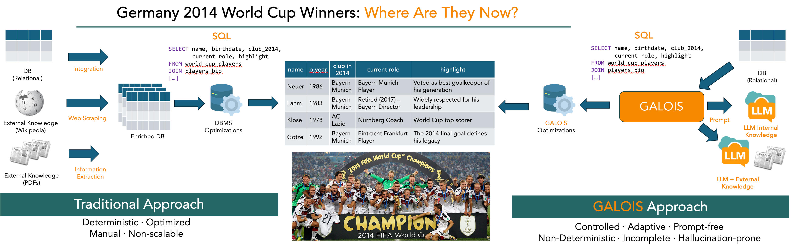
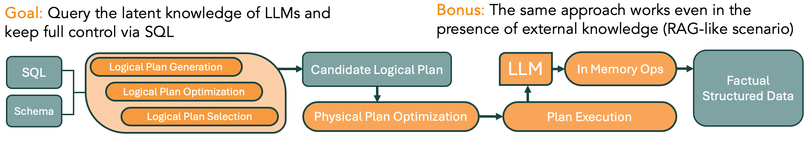
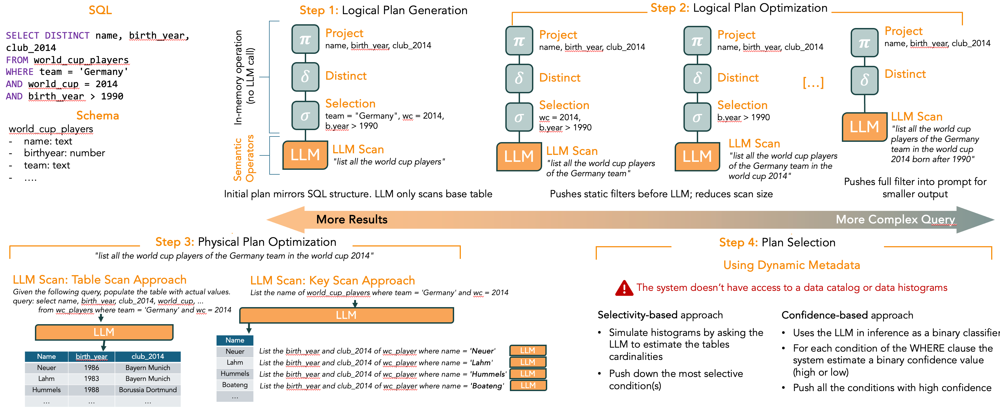

# GALOIS: Logical and Physical Optimizations for SQL Query Execution over Large Language Models

### Motivation: A Data Management Scenario


### System Overview


### Main Challenges
- Parse Output: outputs must be reliably parsed into structured fields
- Long tail problem: Rare or complex cases often trigger inconsistent or unpredictable completions
- Context Size [1]: LLMs handle single facts well, but long outputs degrade reliability – facts get dropped or hallucinated
- Evaluation Metrics: needs of robust evaluation metrics (entity normalization, factual datasets, …) 

### GALOIS in Action


### Experiments

### Related Work
1. Satriani D. et al: [RelationalFactQA: A Benchmark for Evaluating Tabular Fact Retrieval from Large Language Models](https://arxiv.org/abs/2505.21409)
2. Liu, C. et al: [Palimpzest: Optimizing AI-Powered Analytics with Declarative Query Processing](https://palimpzest.org/research/)
3. Shankar S., et al: [DocETL: Agentic Query Rewriting and Evaluation for Complex Document Processing](https://arxiv.org/abs/2410.12189)
4. Patel, L. et al: [Semantic Operators: A Declarative Model for Rich, AI-based Data Processing](https://arxiv.org/abs/2407.11418)
5. Yu, T. et al.: [Spider: A Large-Scale Human-Labeled Dataset for Complex and Cross-Domain Text-to-SQL Parsing](https://arxiv.org/abs/1809.08887)


### Full Paper and Citation
Full paper is available [here](https://www.eurecom.fr/en/publication/8182).
If you would like to cite our work, please use the following citation:

```
@article{GaloisSIGMOD2025,
	author = {Satriani, Dario and Veltri, Enzo and Santoro, Donatello and Rosato, Sara and Varriale, Simone and Papotti, Paolo},
	title = {Logical and Physical Optimizations for SQL Query Execution over Large Language Models},
	year = {2025},
	issue_date = {June 2025},
	publisher = {Association for Computing Machinery},
	address = {New York, NY, USA},
	volume = {3},
	number = {3},
	url = {https://doi.org/10.1145/3725411},
	doi = {10.1145/3725411},
	journal = {Proc. ACM Manag. Data},
	month = jun,
	articleno = {181},
	numpages = {28},
	keywords = {large language models, query optimization, sql}
}
```